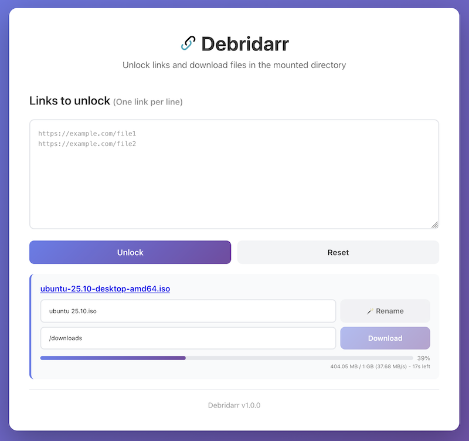

# Debridarr

An app that unlocks links and downloads files.

## Screenshots



## Deployment

To deploy this project with Docker, change the variables in docker-compose.yml and run

```bash
  docker compose up -d
```

## Development

Copy the env file and modify the variables.

```bash
  cp .env.example .env 
```

Install dependencies.

```bash
  npm run install
  npm run dev
```
    
## License

[MIT](https://choosealicense.com/licenses/mit/)
