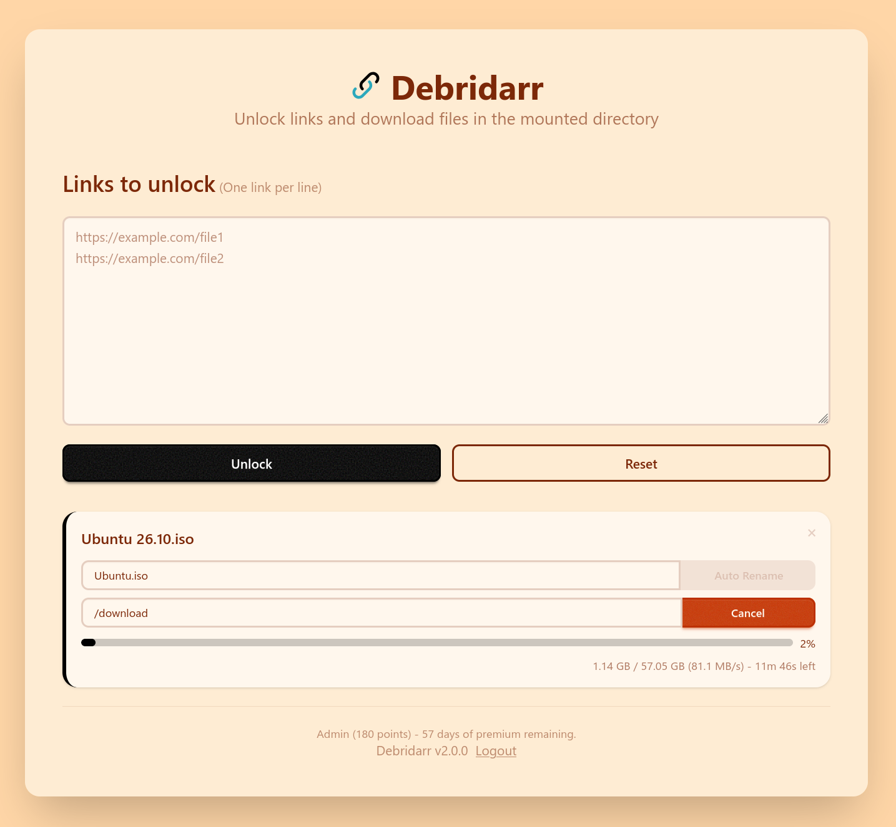

# Debridarr

An app that unlocks links with Alldebrid and downloads files.

## Screenshots



## Deployment

To deploy this project with Docker, change the variables in docker-compose.yml and run

```bash
  docker compose up -d
```

Or

```bash
docker run -d \
  --name debridarr \
  -p 5173:5173 \
  -u $(id -u):$(id -g) \
  -e ALL_DEBRID_API_KEY=your_api_key_here \
  -e AUTH_USERNAME=admin \
  -e AUTH_PASSWORD=change_me \
  -e ROOT_PATH=/your_path \
  -e MOVIES_PATH=/movies \
  -e SERIES_PATH=/series \
  ghcr.io/enishowk/debridarr:latest
```

### Authentication

Set `AUTH_USERNAME` and `AUTH_PASSWORD` to protect the app with a login page. Without them, anyone who can reach the app can use your AllDebrid account and write files to your disk.

The credentials are sent in clear text over HTTP: if the app is exposed outside your local network, put it behind a reverse proxy with HTTPS.

### Reverse proxy

Behind a reverse proxy, set `TRUST_PROXY` so the app gets the real client IP (used by the login rate limit) and detects HTTPS (secure cookie). It accepts `true`, the number of proxies in front of the app, or the proxy IPs/subnets (e.g. `172.16.0.0/12` for a Docker network). Only trust your own proxy: a trusted client can spoof its IP.

## Development

Copy the env file and modify the variables.

```bash
  cp .env.example .env 
```

Install dependencies.

```bash
  npm run install
  npm run dev
```
    
## License

[MIT](https://choosealicense.com/licenses/mit/)
